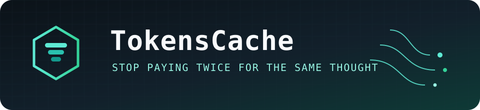

<p align="center">
  
</p>

<p align="center">
  
</p>

<h1 align="center">TokensCache</h1>

<p align="center">
  <b>AI token waste elimination</b> &amp; an intelligent cache layer for multi-provider agents.
</p>

<p align="center">
  <code>exact match → semantic reuse → optimize → budget → provider</code>
</p>

<p align="center">
  <a href="https://github.com/kais-aljammal/tokenscache/actions"></a>
  
  
  
</p>

<p align="center">
  <a href="#quick-start">Quick start</a> ·
  <a href="#test-results">Results</a> ·
  <a href="#architecture">Architecture</a> ·
  <a href="#configuration-reference">Config</a> ·
  <a href="#watermark">Author</a>
</p>

---

```text
   ┌────────────── TokensCache ──────────────┐
   │                                          │
   │   ◆ L1 memory     ◆ L2 IndexedDB         │
   │   ◆ L3 SQLite     ◆ semantic ANN         │
   │                                          │
   │   prune · compress · shape · enforce $   │
   │                                          │
   │   OpenAI  ·  Anthropic  ·  Gemini        │
   └──────────────────────────────────────────┘
              fewer calls · same output
```

## Why it exists

Agents repeat themselves. Same plans. Same tool dumps. Same boilerplate.

**TokensCache** sits in front of your LLM calls and:

- caches exact + semantic matches (L1 → L2 → L3)
- prunes / compresses / shapes prompts before they burn tokens
- enforces real-dollar budgets with warn / downgrade / block
- keeps output quality — verified in mock agent A/B tests

## Status

**v1.0.0** — cache stack, optimizer, budget enforcement, provider adapters, MCP / proxy / dashboard tooling.

## Quick start

```bash
git clone https://github.com/kais-aljammal/tokenscache.git
cd tokenscache
npm install
npm test
npm run build
```

Or install as a dependency (after npm publish):

```bash
npm install tokenscache
```

### Minimal Node usage

```typescript
import { TokensCache } from "tokenscache";

const cache = new TokensCache({
  config: {
    providers: { openai: { apiKey: process.env.OPENAI_API_KEY } },
    cache: { l1: { maxEntries: 500 } },
  },
});

// Register a provider adapter, then:
// const response = await cache.chat({
//   provider: "openai",
//   model: "gpt-4o-mini",
//   messages: [...],
// });
```

Run the mock demo (no API keys):

```bash
npx tsx examples/node-agent/index.ts
```

### Tooling

```bash
npm run bench            # Cache hit-rate benchmark (200 prompts, 30% semantic overlap)
npm run audit            # Token waste report from ./tokenscache.db
npm run sync-pricing     # Verify config/pricing.json is ≤30 days old
npm run cashier-compare  # A/B demo: agent with vs without TokensCache
```

Integration tests in `tests/integration/agent-tasks.test.ts` run 10 mock coding-agent scenarios and assert token savings with identical output.

## Test results

All numbers below are from the repo's automated test suite — no API keys required. Reproduce anytime with `npm test` and `npm run cashier-compare`.

### Test suite

| Check | Result |
|-------|--------|
| Unit + integration tests | **92 / 92 passing** |
| TypeScript | zero errors (`npm run typecheck`) |
| Build | ESM + DTS (`npm run build`) |

### 10 coding-agent scenarios (integration tests)

Mock agents build real TypeScript modules (todo API, URL shortener, auth JWT, etc.) across **105 agent turns**. TokensCache uses `agentArtifactScope` + `verified-decision` semantic matching.

| Metric | Without TokensCache | With TokensCache | Savings |
|--------|-------------------:|----------------:|--------:|
| Upstream LLM calls | 105 | 66 | **37%** |
| Total tokens billed | 42,066 | 27,136 | **35.5%** |
| Cache hits | 0 | 39 | — |
| Output identical | — | **yes** (all 10 tasks) | — |

Per-task token savings range from **28%** to **39%**. Every scenario asserts identical generated code with vs without TokensCache.

### Cashier A/B demo (`npm run cashier-compare`)

Single-task side-by-side: 15-turn agent building a TypeScript POS system.

| Metric | Without | With | Savings |
|--------|--------:|-----:|--------:|
| Upstream LLM calls | 15 | 9 | 40% |
| Total tokens | 6,382 | 3,893 | **39.0%** |
| Quality score | 9.8/10 | 9.8/10 | unchanged |
| Output identical | — | **yes** | — |

```text
 without  ████████████████████  6,382 tokens
 with     ████████████░░░░░░░░  3,893 tokens   (−39%)
```

## Architecture

```text
 Request
    │
    ▼
 ┌─────────────┐
 │ CacheRouter │── L1 (memory) → L2 (IndexedDB) → L3 (SQLite) → Semantic
 └──────┬──────┘
        │ miss
        ▼
 ┌─────────────┐
 │  Optimizer  │── tool prune · history compress · output shape · cache align
 └──────┬──────┘
        ▼
 ┌──────────────┐
 │BudgetEnforcer│── estimate cost · check limits · downgrade route
 └──────┬───────┘
        ▼
 ┌─────────────┐
 │  Provider   │── OpenAI · Anthropic · Gemini
 └─────────────┘
```

| Layer | Module | Description |
|-------|--------|-------------|
| **L1** | `l1-memory.ts` | In-memory LRU exact-match cache |
| **L2** | `l2-browser.ts` | Browser IndexedDB persistence |
| **L3** | `l3-local.ts` | SQLite + embedding ANN search |
| **Semantic** | `semantic-match.ts` | Cosine similarity with threshold policies |
| **Optimizer** | `optimizer/*` | Token reduction before provider calls |
| **Budget** | `budget/*` | Real-dollar ledger and enforcement |
| **Providers** | `providers/*` | Unified adapter interface |

Browser apps import from `tokenscache/browser` — see [examples/browser-react/README.md](examples/browser-react/README.md).

MCP guide: [examples/mcp-server/README.md](examples/mcp-server/README.md) · Agent demo: [examples/cashier-comparison/README.md](examples/cashier-comparison/README.md).

## Configuration reference

Configuration is validated with Zod via `TokensCacheConfigSchema`.

```typescript
{
  providers: {
    openai: { apiKey?: string, baseUrl?: string },
    anthropic: { apiKey?: string, baseUrl?: string },
    google: { apiKey?: string, baseUrl?: string },
  },
  budget?: {
    daily?:   { usd: number, action: "warn" | "downgrade" | "block" },
    session?: { usd: number, action: "warn" | "downgrade" | "block" },
    hard?:    { usd: number, action: "warn" | "downgrade" | "block" },
    includeCacheStorageHoldingCosts?: boolean,  // default true
  },
  cache?: {
    l1?: { maxEntries: number },                // default 500
    l2?: { dbName: string, maxSizeMB: number }, // browser
    l3?: { dbPath: string, maxSizeMB: number }, // default ./tokenscache.db
    semantic?: {
      highThreshold: number,      // default 0.92
      grayZoneMin: number,        // default 0.7
      matchPolicy: "static-threshold" | "verified-decision",
    },
    agentArtifactScope?: boolean, // reuse cache per metadata.artifact
    gemini?: { explicitCacheSafetyMargin: number },
  },
  optimizer?: {
    toolPruning: boolean,
    historyCompression: boolean,
    compressionTrigger: number,
    outputShaping: boolean,
    outputShapingTrigger: number,
    outputShapingHoldout: number,
    cacheAlignment: boolean,
  },
}
```

Pricing tiers live in [config/pricing.json](config/pricing.json). Refresh when providers change rates:

```bash
npm run sync-pricing
```

## Contributing & security

- [CONTRIBUTING.md](CONTRIBUTING.md)
- [SECURITY.md](SECURITY.md)
- [License audit](docs/license-audit.md)

## License

TokensCache is released under the **[MIT License](LICENSE)**.

You may use, modify, and distribute this software freely, including in commercial projects, as long as the license notice is included.

Third-party inspiration and dependency licenses are documented in [docs/license-audit.md](docs/license-audit.md).

---

<a id="watermark"></a>

<p align="center">
  
</p>

<p align="center">
  <sub>
    ✦ crafted by <b>Kais Aljammal</b> · <code>kaiss.tech</code><br/>
    Instagram → <a href="https://instagram.com/kaiss.tech"><b>@kaiss.tech</b></a><br/>
    GitHub → <a href="https://github.com/kais-aljammal">@kais-aljammal</a>
  </sub>
</p>

```text
  ┌─────────────────────────────────────────┐
  │  TokensCache  ·  kaiss.tech watermark   │
  │  © 2026 Kais Aljammal                   │
  │  instagram.com/kaiss.tech               │
  └─────────────────────────────────────────┘
```
